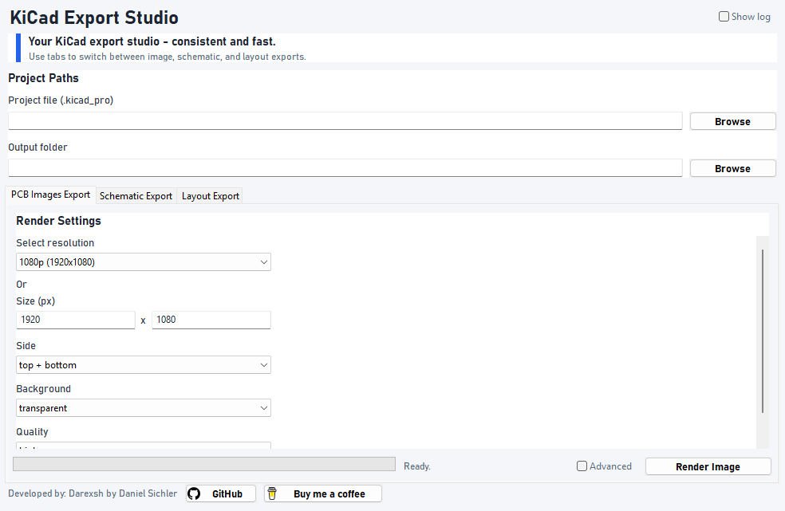
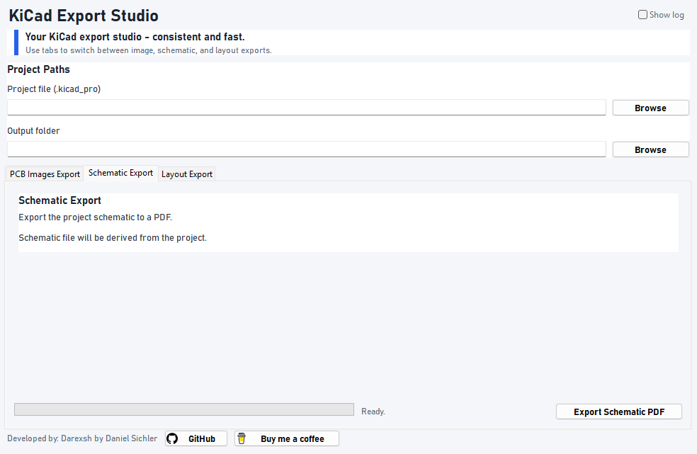
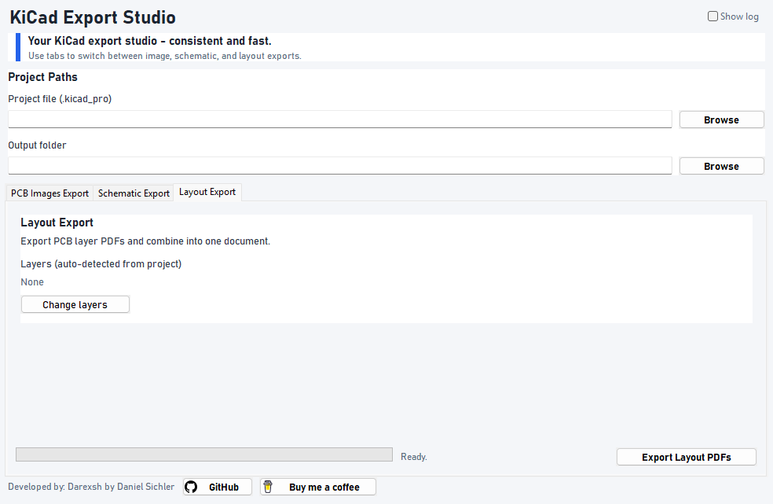

* * *

<div align="center">

🧰 KiCad Export Studio
======================

**A desktop GUI for exporting KiCad PCB images, schematics, and layout PDFs via `kicad-cli` with repeatable settings**  
🖼️🧩⚙️

   [](https://buymeacoffee.com/darexsh)

</div>

* * *

✨ Authors
---------

| Name | GitHub | Role | Contact | Contributions |
| --- | --- | --- | --- | --- |
| **[Darexsh by Daniel Sichler](https://github.com/Darexsh)** | [Link](https://github.com/Darexsh?tab=repositories) | GUI + KiCad Render Workflow | 📧 [E-Mail](mailto:sichler.daniel@gmail.com) | UI Layout, Render Automation, Preset Wiring |


* * *

🚀 About the Project
==============

A lightweight GUI for **KiCad 9+** that exports consistent outputs without retyping long CLI commands. Select a `.kicad_pro`, choose render options, export PCB images, schematic PDFs, and combined layout layer PDFs.

* * *

✨ Features
-----------

* **Project-based workflow:** select a `.kicad_pro` and auto-detect related files
    
* **PCB Images Export:** render sides (top/bottom/left/right/front/back), backgrounds, quality, advanced camera + lighting
    
* **Schematic Export:** one-click schematic PDF export
    
* **Layout Export:** export PCB layer PDFs and combine into one document (via `pdfunite`)
    
* **Layer selection:** change which layers are exported and combined
    
* **Progress + log output** during exports

* * *

📸 Screenshots
--------------

<table>
  <tr>
    <td align="center"><b>PCB Images Export</b><br></td>
    <td align="center"><b>Schematic Export</b><br></td>
    <td align="center"><b>Layout Export</b><br></td>
  </tr>
</table>

* * *

⚡ Quick Install
---------------

1. Clone or [download this repo](#).
    
2. Install **KiCad 9+** so `kicad-cli` is available.
    
3. Install Python dependencies:
    
```bash
pip install -r requirements.txt
```
    
4. Run the app:
    
```bash
python kicad_export_gui.py
```

*Windows users:* you can also download a prebuilt `.exe` from the **Releases** page, or build it yourself (see below).

* * *

📥 Detailed Installation
------------------------

1. **Install prerequisites**
    
    * Python 3.x
        
    * wxPython (see `requirements.txt`)
        
    * KiCad 9+ (for `kicad-cli`)
        
    * Poppler (`pdfunite`) for layout PDF combine (Windows: install Poppler and add to PATH)
        
2. **Configure KiCad command path (Windows)**
    
    * Update `KICAD_CMD_DEFAULT` in `ui_constants.py` if your KiCad install path differs
        
3. **Launch the app**
    
    * Run `python kicad_export_gui.py`
        
    * Select a `.kicad_pro` project file and output folder
        
    * Use the tabs to export PCB images, schematics, and layout PDFs
        

* * *

📝 Notes
--------

* On Windows, the app uses `cmd.exe` to run `kicad-cli` via the `kicad-cmd.bat` path
    
* Output files are named by side, e.g. `top.png` and `bottom.png`
    
* Layout export uses `pdfunite` to combine layer PDFs into `Project_board_layers.pdf`
    
* Works best on the latest KiCad 9+ builds

* **Build a Windows .exe (optional)**  
  From repo root (CMD):
  ```bash
  pyinstaller --onefile --name kicad_export_studio --noconsole ^
    --add-data "src\\icons;src\\icons" ^
    src\\kicad_export_gui.py
  ```
  From `src` folder:
  ```bash
  pyinstaller --onefile --name kicad_export_studio --noconsole ^
    --add-data "icons;icons" ^
    kicad_export_gui.py
  ```
  The output is in `dist\\kicad_export_studio.exe`.

* **Commercial use is not permitted**. You may use, modify, and distribute this project only for non-commercial purposes.
    

* * *

📜 License
----------

This project is licensed under the **Non-Commercial Software License (MIT-style) v1.0** and was developed as an educational project. You are free to use, modify, and distribute the code for **non-commercial purposes only**, and must credit the author:

**Copyright (c) 2025 Darexsh by Daniel Sichler**

Please include the following notice with any use or distribution:

> Developed by Daniel Sichler aka Darexsh. Licensed under the Non-Commercial Software License (MIT-style) v1.0. See `LICENSE` for details.

The full license is available in the [LICENSE](LICENSE) file.

* * *

<div align="center"> <sub>Created with ❤️ by Daniel Sichler</sub> </div>
